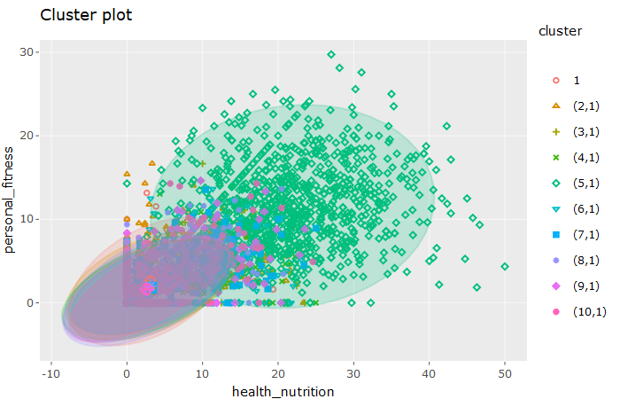
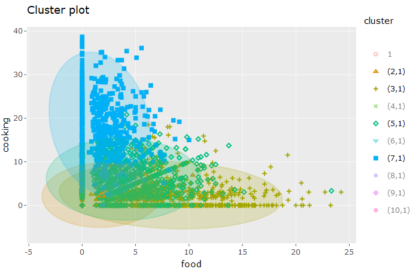
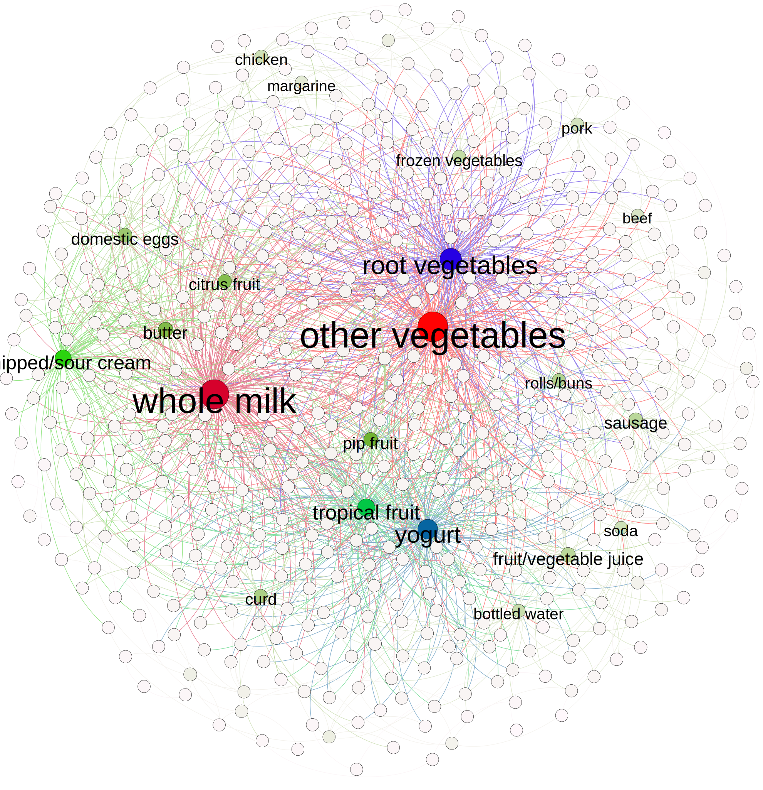

#Question 1

```{r setup, include=FALSE}
knitr::opts_chunk$set(echo = TRUE)
```

```{r}
library(ggplot2)
library(tidyverse)
library(dplyr)
library(tidyr)
```

```{r}
buildings = read.csv("../../data/greenbuildings.csv")
```

CLEANING THE DATA
1) Missing data
```{r}
sum(is.na(buildings))
#Very few rows where empl_gr is missing
buildings = na.omit(buildings)
```

2) Factorizing categorical columns
```{r}
#Factorizing categorical columns
buildings$renovated = factor(buildings$renovated)
buildings$class_a = factor(buildings$class_a)
buildings$class_b = factor(buildings$class_b)
buildings$LEED = factor(buildings$LEED)
buildings$Energystar = factor(buildings$Energystar)
buildings$green_rating = factor(buildings$green_rating)
buildings$net = factor(buildings$net)
buildings$amenities = factor(buildings$amenities)
```

EXPLORATORY DATA ANALYSIS

Green Rated Building Distribution by Age:
```{r}

buildAgeDist = buildings %>%
  mutate(agecat = cut(age, c(0, 30,60,90,120)))

buildAgeDist = na.omit(buildAgeDist)

buildAgeDist = buildAgeDist %>%
  group_by(green_rating,agecat) %>%
  summarize(buildCount = sum(CS_PropertyID))

ggplot(data = buildAgeDist) + 
  geom_bar(mapping = aes(x=agecat, y=buildCount,
                         fill=factor(green_rating)),
           stat='identity', position ='dodge') + 
  labs(title="Green Rated Building Distribution by Age", 
       y="Number of Buildings",
       x = "Building Age",
       fill="Green Rating")
```

Green rated building are newer on average.

Green Rated Building Distribution by Building Class:
```{r}

#create column for class_c
buildings$class_c = 0
buildings[buildings$class_a==0 & buildings$class_b==0,]$class_c = 1
 
#combine all classes into one categorical column
buildings$class = names(buildings[c('class_a','class_b','class_c')])[max.col(buildings[c('class_a','class_b','class_c')])]
buildings$class = factor(buildings$class)

ggplot(buildings,aes(class)) +
  geom_bar(aes(fill=green_rating),position = 'dodge') +
  labs(title="Green Rated Building Distribution by Class", 
       y="Number of Buildings",
       x = "Building Class",
       fill="Green Rating")
```

Most green rated buildings are also class A buildings. (Class C has only 7 green rated buildings)

```{r}
nrow(buildings[(buildings$class_c == 1) & (buildings$green_rating == 1),])
```

There are only 7 Class C green rated buildings, which is too small a sample to trust any results for green-rated class C buildings - therefore, we will not focus on class C green rated buildings for the rest of this analysis.

Leasing Rate Distribution by Building Class:
```{r}
ggplot(data=buildings) + 
  geom_histogram(aes(x=leasing_rate, stat(density)), binwidth=2) + 
  facet_grid(class~.) +
  theme_bw(base_size=18)
```

Class A buildings have the highest leasing rate, then Class B, and Class C has a large number of buildings at a leasing rate of 0%.

Rent Distribution among Building Classes:
```{r}
ggplot(buildings,aes(x=factor(class),y=Rent)) +
  geom_boxplot(aes(fill=factor(green_rating))) +
  labs(title="Rent Distribution among Building Classes", 
       y="Rent per Square Foot",
       x = "Building Class",
       fill="Green Rating")

#Numeric analysis to get median rent of class A and B, green vs non-green
x1=subset(buildings,(green_rating == 0 & class_a==1))
nongreen_A_rent = median(x1[,5])
x2=subset(buildings,(green_rating == 1 & class_a==1))
green_A_rent = median(x2[,5])

y1=subset(buildings,(green_rating == 0 & class_b==1))
nongreen_B_rent = median(y1[,5])
y2=subset(buildings,(green_rating == 1 & class_b==1))
green_B_rent = median(y2[,5])

sprintf("Median rent for non-green class A is %f", nongreen_A_rent)
sprintf("Median rent for green class A is %f", green_A_rent)
sprintf("Median rent for non-green class B is %f", nongreen_B_rent)
sprintf("Median rent for green class B is %f", green_B_rent)
```

Based on the above box and whisker plots, median rent of Class A green rated and non-green rated buildings appear to be the same. Median rent of Class B green rated buildings seems to be slightly higher than its non-green rated buildings.  
Therefore, it is apparent that green rating by itself does not imply that the building can charge a higher rent per square foot.


Repeat above plot for only buildings with leasing rate > 50%
```{r}
occupied = filter(buildings, leasing_rate > 50)

ggplot(occupied,aes(x=factor(class),y=Rent)) +
  geom_boxplot(aes(fill=factor(green_rating))) +
  labs(title="Rent Distribution among Building with High Occupancy", 
       y="Rent per Square Foot",
       x = "Building Class",
       fill="Green Rating")

```

At a leasing rate of greater than 50%, we see a similar trend as before, with median rent for green rated vs non-green rated for Class A and B been almost equal.

Rent Distribution among Renovated Buildings by Building Class:
```{r}
renovated = filter(buildings, renovated == 1)

ggplot(renovated,aes(x=factor(class),y=Rent)) +
  geom_boxplot(aes(fill=factor(green_rating))) +
  labs(title="Rent Distribution among Renovated Buildings", 
       y="Rent per Square Foot",
       x = "Building Class",
       fill="Green Rating")
```

From the renovated buildings, green rated class A buildings has a higher median rent than non-green class A buildings. However, for class B renovated buildings, those that are green rated have a LOWER median rent than those that are not green rated.

Rent Distribution among UN-Renovated Buildings by Building Class:
```{r}
renovated = filter(buildings, renovated == 0)

ggplot(renovated,aes(x=factor(class),y=Rent)) +
  geom_boxplot(aes(fill=factor(green_rating))) +
  labs(title="Rent Distribution among Unrenovated Buildings", 
       y="Rent per Square Foot",
       x = "Building Class",
       fill="Green Rating")
```

It is interesting to see that for Class A unrenovated buildings, those that are green rated have a LOWER median rent than those that are not green rated.

Rent Distribution based on Ameneties:
```{r}
#Rent based on ameneties
ggplot(buildings,aes(x=factor(class),y=Rent)) +
  geom_boxplot(aes(fill=factor(amenities))) +
  labs(title="Rent Distribution based on Presence of Ameneties", 
       y="Rent per Square Foot",
       x = "Building Class",
       fill="Amenities")
```

It is interesting to see that buildings that have amenities have a lower median rent per square foot in buildings belonging to classes A, B, and C.

Electricity Cost Comparison:
```{r}
#Electricity Costs based on green rating
ggplot(buildings,aes(x=factor(class),y=Electricity_Costs)) +
  geom_boxplot(aes(fill=factor(green_rating))) +
  labs(title="Electricity Costs Distribution", 
       y="Electricity Costs",
       x = "Building Class",
       fill="Green Rating")
```

Class A green rated buildings does seem to have a lower median electricity cost, however, its interquartile range for electricity cost is similar to the non-green rated Class A buildings
The median and 3rd quartile for class B green rated buildings are equal suggesting higher electricity costs for class B green rated buildings.

Gas Cost Comparison:
```{r}
#Gas Costs based on green rating
ggplot(buildings,aes(x=factor(class),y=Gas_Costs)) +
  geom_boxplot(aes(fill=factor(green_rating))) +
  labs(title="Gas Costs Distribution", 
       y="Gas Costs",
       x = "Building Class",
       fill="Green Rating")
```

It looks like there is not a lot of variation in median gas costs amongst the buildings.

Conclusion:
The data does not support the 'Excel guru's' conclusion that they can charge an extra 2.60 of rent per square foot on their green-rated building compared to the market rate. The data only shows a $0.24 median increase in rent among the current green rated class A buildings compared to non-green class A buildings. The data only shows a 1.10 median increase in rent among the current green rated class B buildings compared to non-green class B buildings.
Additionally, we can see that several other factors explored above, such as ameneties, leasing rate, building renovation, all play a role in determining the rent that can be charged.

#Question 2

```{r, warning=FALSE, message = FALSE}
library("tidyverse")
ABIA <- read.csv("../../data/ABIA.csv")
ABIA[is.na(ABIA)] = 0
```

```{r}
ABIA$date <- as.Date(with(ABIA, paste(Year, Month, DayofMonth,sep="-")), "%Y-%m-%d")
```

```{r, warning=FALSE, message = FALSE}
theme_set(theme_classic())
g <- ggplot(ABIA, aes(x=(UniqueCarrier), DepDelay))
g + geom_boxplot(fill="plum", outlier.shape = NA) + 
  scale_y_continuous(limits = quantile(ABIA$DepDelay, c(0.1, 0.9))) +
    labs(title="Box plot", 
         subtitle="Dep Delay grouped by Carrier",
         caption="Source: ABIA",
         x="Carrier",
         y="Departure Delay")
```
Most of the carriers's flights depart on average on or before the scheduled departure time. 


```{r, warning=FALSE, message = FALSE}
theme_set(theme_classic())
g <- ggplot(ABIA, aes(UniqueCarrier, DepDelay))
g + geom_violin(fill="plum", outlier.shape = NA) + 
  scale_y_continuous(limits = quantile(ABIA$DepDelay, c(0.1, 0.9))) +
    labs(title="Violin plot", 
         subtitle="Dep Delay grouped by Carrier",
         caption="Source: ABIA",
         x="Carrier",
         y="Departure Delay")
```

The violin plot shows that some carriers are stingy when it comes to when the flight departs. Carriers OH and YV like their flights to depart right on time instead of early.


```{r}
ABIA_summ = ABIA %>%
  group_by(UniqueCarrier)  %>%  # group the data points by model name
  summarize(Del.mean = mean(DepDelay))  # calculate a mean for each model
```

```{r}
# reorder the x labels
ggplot(ABIA_summ, aes(x=reorder(UniqueCarrier, Del.mean), y=Del.mean)) + 
  geom_bar(stat='identity') + 
  coord_flip()
```

```{r}
# first add a new column using the mutate function
ABIA_summ = mutate(ABIA_summ, Del.z = (Del.mean - mean(Del.mean))/sd(Del.mean))

# now plot the newly defined variable
ggplot(ABIA_summ, aes(x=reorder(UniqueCarrier, Del.z), y=Del.z)) + 
  geom_bar(stat='identity') + 
  labs(title="Dep Delay by Carrier", 
       caption="Source: ABIA",
       y="Dep Delay (z-score)",
       x = "Carrier") + 
  coord_flip()
```

This shows that Carrier EV has the highest average departure delay of any carrier and US has the lowest average departure delay of any carrier. 

```{r}
ABIA$delay = names(ABIA[c('CarrierDelay','WeatherDelay','NASDelay','SecurityDelay','LateAircraftDelay')])[max.col(ABIA[c('CarrierDelay','WeatherDelay','NASDelay','SecurityDelay','LateAircraftDelay')])]
ABIA$delay = factor(ABIA$delay)
```

```{r}
ABIA$Month = factor(ABIA$Month)
ABIA$DayOfWeek = factor(ABIA$DayOfWeek)
```

```{r}
ggplot(ABIA,aes(factor(Month))) +
  geom_bar(aes(fill=factor(delay)), position = 'dodge') +
  labs(title="Flight Delays in Austin", 
       y="Number of Delayed Flights",
       x = "Month") + scale_fill_brewer(palette="Dark2")
  
```

There seems to be less overall flight delays during September, October, and November. Most flight delays are caused by late aircraft.

```{r}
ggplot(ABIA,aes(factor(DayOfWeek))) +
  geom_bar(aes(fill=factor(delay)), position = 'dodge') +
  labs(title="Flight Delays in Austin", 
       y="Number of Delayed Flights",
       x = "Day of the Week (1: Monday)") + scale_fill_brewer(palette="Dark2")
```

There seems to be significantly less aircraft delays on Saturdays. Once again, most aircraft delays are due to late aircraft.

#Question 3

```{r, warning=FALSE, message = FALSE}
library(mosaic)
library(quantmod)
library(foreach)
```
```{r}
#### Now use a bootstrap approach
#### With more stocks

mystocks = c("IWR", "LQD", "VWO", "USO", "VNQI")
myprices = getSymbols(mystocks, from = "2014-01-01")

```

IWR = Largest All Cap Equities ETF = All cap equities ETFs are funds that invest in equities of all market capitalizations. These funds may include micro cap, small cap, mid cap or large cap stocks. This ETF is one of several ETFs available that offers exposure to mid cap U.S. stocks, an asset class that can make up a significant portion of long-term, buy-and-hold portfolios. As such, this ETF may be more appealing to those in the portfolio construction process as opposed to short term traders. Mid cap stocks are appealing to many because they still have significant growth potential but they are less risky than their small and micro cap brethren = mid risk

LQD = Largest Corporate Bonds ETF = Corporate bonds ETFs invest in debt issued by corporations with investment-grade credit ratings. Bonds included in these funds can feature varying maturities and are issued by companies from multiple industries. This ETF is the most popular option for investors looking to gain exposure to investment grade corporate bonds, making it a useful tool for those looking to access a corner of the bond market that should be a core component of any long-term, buy-and-hold portfolio = Safe

VWO = Largest Emerging Markets Equities ETF = Leveraged ETFs allow investors to boost returns on an index by using financial derivatives and debt. These ETFs are available for most indices such as the S&P 500 and the NASDAQ composite, and deliver returns in multiples of the underlying index. this fund can be used as a short-term trading vehicle or as a core holding in a long-term, buy-and-hold portfolio. It should be noted, however, that VWO tends to attract longer-term investors = Safe

USO = Largest Oil & Gas ETF = Oil & Gas ETFs invest directly in oil or gas and/or their subsidiary commodities. Note that these funds almost always utilize futures exposure to invest in their respective commodities. This fund offers exposure to one of the the world's most important commodities, oil, and potentially has appeal as an inflation hedge. While oil may be appealing, USO often suffers from severe contango making the product more appropriate for short-term traders = risky

VNQI = Largest Global Real Estate ETF = Global Real Estate ETFs invest in real estate companies from all over the world. These ETFs can offer broad exposure to the industry, or can target specific subsectors such as residential property. In addition, some of these funds focus on the global ex-U.S. market, while others target a specific region or country. As such, VNQI has the potential to deliver broad-based access to an asset class that can deliver attractive current returns and significant appreciation for long term capital appreciation (along with meaningful volatility and risk) = mid risk

```{r, warning=FALSE, message = FALSE}
# A chunk of code for adjusting all stocks
# creates a new object adding 'a' to the end
# For example, WMT becomes WMTa, etc
for(ticker in mystocks) {
	expr = paste0(ticker, "a = adjustOHLC(", ticker, ")")
	eval(parse(text=expr))
}

#head(IWRa)

```
```{r}
# Combine all the returns in a matrix
all_returns = cbind(	ClCl(IWRa),
								ClCl(LQDa),
								ClCl(VWOa),
								ClCl(USOa),
								ClCl(VNQIa))
#head(all_returns)
all_returns = as.matrix(na.omit(all_returns))

```

## Portfolio 1
```{r}
set.seed(1)
# Now simulate many different possible scenarios  
initial_wealth = 100000
sim1 = foreach(i=1:5000, .combine='rbind') %do% {
	total_wealth = initial_wealth
	weights = c(0.2, 0.2, 0.2, 0.2, 0.2)
	holdings = weights * total_wealth
	n_days = 20
	wealthtracker = rep(0, n_days)
	for(today in 1:n_days) {
		return.today = resample(all_returns, 1, orig.ids=FALSE)
		holdings = holdings + holdings*return.today
		total_wealth = sum(holdings)
		holdings = weights * total_wealth
		wealthtracker[today] = total_wealth
	}
	wealthtracker
}

#head(sim1)
#hist(sim1[,n_days], 30)

# Profit/loss
cat("mean profit/loss =", mean(sim1[,n_days]),"\n")
hist(sim1[,n_days]- initial_wealth, breaks=30)

# bootstrapped standard errors
cat("standard error =",sd(sim1), "\n")

#VaR
quantile(sim1[,n_days]- initial_wealth, 0.05)
```

## Portfolio 2
```{r}
set.seed(1)
# Now simulate many different possible scenarios  
initial_wealth = 100000
sim1 = foreach(i=1:5000, .combine='rbind') %do% {
	total_wealth = initial_wealth
	weights = c(0.2, 0.05, 0.05, 0.5, 0.2)
	holdings = weights * total_wealth
	n_days = 20
	wealthtracker = rep(0, n_days)
	for(today in 1:n_days) {
		return.today = resample(all_returns, 1, orig.ids=FALSE)
		holdings = holdings + holdings*return.today
		total_wealth = sum(holdings)
		holdings = weights * total_wealth
		wealthtracker[today] = total_wealth
	}
	wealthtracker
}

#head(sim1)
#hist(sim1[,n_days], 25)

# Profit/loss
mean(sim1[,n_days])
#hist(sim1[,n_days]- initial_wealth, breaks=30)

# Profit/loss
cat("mean profit/loss =", mean(sim1[,n_days]),"\n")
hist(sim1[,n_days]- initial_wealth, breaks=30)

# bootstrapped standard errors
cat("standard error =",sd(sim1), "\n")

#VaR
quantile(sim1[,n_days]- initial_wealth, 0.05)
```

## Portfolio 3
```{r}
set.seed(1)
# Now simulate many different possible scenarios  
initial_wealth = 100000
sim1 = foreach(i=1:5000, .combine='rbind') %do% {
	total_wealth = initial_wealth
	weights = c(0.1, 0.5, 0.25, 0.05, 0.1)
	holdings = weights * total_wealth
	n_days = 20
	wealthtracker = rep(0, n_days)
	for(today in 1:n_days) {
		return.today = resample(all_returns, 1, orig.ids=FALSE)
		holdings = holdings + holdings*return.today
		total_wealth = sum(holdings)
		holdings = weights * total_wealth
		wealthtracker[today] = total_wealth
	}
	wealthtracker
}

#head(sim1)
#hist(sim1[,n_days], 25)

# Profit/loss
mean(sim1[,n_days])
#hist(sim1[,n_days]- initial_wealth, breaks=30)

# Profit/loss
cat("mean profit/loss =", mean(sim1[,n_days]),"\n")
hist(sim1[,n_days]- initial_wealth, breaks=30)

# bootstrapped standard errors
cat("standard error =",sd(sim1), "\n")

#VaR
quantile(sim1[,n_days]- initial_wealth, 0.05)
```

Portflio 1 was intended to be a mid risk, diverse portfolio both in terms of weight for each stock and the stocks themselves. We choose 1 high risk stock (USO), two mid risk (IWR, VNQI), and two safe stocks (LQD, VWO). These stocks also range from emerging markets ETFs (very diverse) to Oil and Gas ETFs (very specialized). The weights for Portfilio 1 where all equal to eachother. 

Portfolio 2 was intended to be a risky, semi-deverse portfolio. More weight was given to the risky ETF (USO) and some to the mid risk ETFs and little weight to safe ETFs. 

Portfolio 3 was intended to be a safe, diverse portfolio with most of the weight given to the safe ETFs and less given to the risky or mid-risk ETFs.

The results show that Porfolio 3 had the lowest VaR at -3,187, with Portfolio 1 coming in second at -5,567, and Portfolio 2 was the riskiest with a VaR of -9,025. So our weights and chosen ETFs worked as intended in terms of risk. Another thing to note is that Portfolio 1 on average gained the most value over the other Portfolios. 

The distributions of earnings are all normal but have a significant outlier in the positive direction. This seemed odd, but under further inspection, it seems that the IWR ETF had some incredibly good earnings on Oct. 21st 2016 with a jump from 41 dollars to 170 dollars in one day! But on the very next day, IWR went back down to $41. So based on the weights, the boostrap sampled that day muiltiple times and since Portfolio 1 had the highest weight for IWR, the outlier was more pronounced than the other portfolios. This could be viewed as a flaw of the boostrap method for choosing assest allocations. 

#Question 4

```{r}
library(factoextra)
library(plotly)
library(LICORS)
```

K means:

```{r}
social_marketing = read.csv("../../data/social_marketing.csv", header = TRUE, row.names = 1)
```

```{r}
social_marketing$sum = rowSums(social_marketing)

social_marketing = social_marketing[ social_marketing$sum > 25,  ]
social_marketing$sum = NULL

social_marketing = social_marketing / rowSums(social_marketing)
social_marketing = social_marketing * 100
```

```{r}
scaled = scale(social_marketing, center=TRUE, scale=TRUE)
clust_num = 10
set.seed(1)
clust = kmeanspp(scaled, k=clust_num, nstart=100)
```

```{r}
for (i in 1:clust_num){
  assign(paste('cluster', i, sep = '_'), colMeans(social_marketing[which(clust$cluster == i),]))
}
```

```{r}
means = data.frame(do.call(rbind, mget(ls(pattern="^cluster\\_\\d+"))))
#means = means * 100
```

```{r}
means[ apply(means, 1, max) > 20, ]
```


```{r}
means[ apply(means, 1, max) < 15, ]
```

```{r}
means[means$health_nutrition < 2.75,]
```

```{r}
means[means$personal_fitness < 1.75,]
```

```{r}
for (i in 1:clust_num){
  len = length(which(clust$cluster == i))
  cat("Cluster", i, "has" , len, "members\n")
}

```


To indentify market segments for NutrientH20 we performed clustering. We experimented with different cluster sizes and methods, deciding that k-means with 10 clusters provided the clearest interpretation.

To preprocess our data, we first removed all users whoose volume of tweets fell in the botomn quartile of our data set. With such a low volume of tweets, trends were difficult to indentify, and we reccomend that they be delivered generic marketing. After removing these users, we converted our data for each user to percentage of tweets for each category.


For the rest of our considered users, several trends became apparent:

Cluster 1:

This cluster of 179 users had an average of 21% of tweets categorized as adult material. We believe these are likely pornography accounts/bots.

Cluster 2:

This cluster of 1039 users had an average of 22% of tweets categorized as chatter. We believe that this category may have been overused as a substitute for uncategorized tweets, and that generic marketing is sufficient for this segment.

Cluster 5:

This cluster of 1008 users had an average of 21% of tweets categorized as health_nutrition. Furthermore, looking at the below plot shows that this cluster also has a correlated interest in personal fitness. We reccomend marketing that caters to these interests and consider this our most general target audience.

```{r}

```


Clusters 3 and 7:

These clusters of 635 and 831 users respectively have a moderate focus on cooking and food. Furthermore, looking at a plot of these two categories reveals that our target audience with a focus on health_nutrition and personal fitness lies at the intersection of interest in cooking and food, another potential marketing method that would span several market segmentations.

```{r}

```


Clusters 6, 9, and 10:

These clusters of 1407 users display a low percentage of both the personal_fitness and health_nutrition category (<2.75% health_nutrition, <1.75 personal_fitness). We believe that marketing to these groups should focus on incorporate some other aspect with a high tweet volume. As an example, these clusters have moderate focuses on politics and news that indicate that an article written from a reputable news source on the product benefits may work well as a marketing tool.

#Question 5

```{r}
test.documents = read.csv("../../data/ReutersC50/test_documents3.csv", header = TRUE, row.names = 1)
test.bigrams = read.csv("../../data/ReutersC50/test_bigrams3.csv", header = TRUE, row.names = 1)

train.documents = read.csv("../../data/ReutersC50/train_documents3.csv", header = TRUE, row.names = 1)
train.bigrams = read.csv("../../data/ReutersC50/train_bigrams3.csv", header = TRUE, row.names = 1)


train.bigrams = train.bigrams + .001
test.bigrams = test.bigrams + .001
```


Start here:

```{r}
N = nrow(train.bigrams)
D = ncol(train.bigrams)

# TF weights
TF_mat = train.bigrams/rowSums(train.bigrams)
# IDF weights
IDF_vec = log(1 + N/colSums(train.bigrams > 0))
# TF-IDF weights:
# use sweep to multiply the columns (margin = 2) by the IDF weights
TFIDF_mat = sweep(TF_mat, MARGIN=2, STATS=IDF_vec, FUN="*")
```

```{r}
# PCA on the TF-IDF weights
pca = prcomp(TFIDF_mat, scale=TRUE)
pve = summary(pca)$importance[3,]
plot(pve)  # not much of an elbow
```

```{r}
X = pca$x[,1:1000]
y = {train.documents$author}
```


Now do the PCA for test set and predict:

```{r}
N = nrow(test.bigrams)
D = ncol(test.bigrams)

#remove 0 row sums
test.bigrams = test.bigrams[rowSums(test.bigrams) != 0,]
test.documents = test.documents[row.names(test.bigrams),]
#remove 0 col sums
test.bigrams = test.bigrams[,colSums(test.bigrams) != 0]

# TF weights
TF_mat = test.bigrams/rowSums(test.bigrams)
# IDF weights
IDF_vec = log(1 + N/colSums(test.bigrams > 0))
# TF-IDF weights:
# use sweep to multiply the columns (margin = 2) by the IDF weights
TFIDF_mat = sweep(TF_mat, MARGIN=2, STATS=IDF_vec, FUN="*")  

# PCA on the TF-IDF weights
pca = prcomp(TFIDF_mat, scale=TRUE)
pve = summary(pca)$importance[3,]
plot(pve)  # not much of an elbow

Xtest = pca$x[,1:1000]
ytest = {test.documents$author}


```

```{r}
library(randomForest)
finrf = randomForest(x = X, y = y, ntree=500)
```

```{r}
pred = predict(finrf, newx = Xtest, newy = ytest)
```

```{r}
comp = data.frame(cbind(as.character(pred), as.character(ytest)))
names(comp) = c('predicted', 'actual')
comp$correct = comp$predicted == comp$actual
```

```{r}
cat('Test set accuracy:', length(which(comp$correct))/2500)
```

```{r}
source("http://pcwww.liv.ac.uk/~william/R/crosstab.r")
tab = crosstab(comp, row.vars = "predicted", col.vars = "actual", type = "f")
write.csv(tab$crosstab, '../tab.csv')
tab = read.csv('../tab.csv', header = TRUE, row.names = 1)
```

```{r}
for (i in 1:50){
  cat(as.character(tab[i,i]/.5),'%', ' accuracy predicting ', names(tab)[i], '\n', sep = '')
}
```

Report:

Data Pipeline: The Reuters C50 corpus consists of text documents from 50 authors, for our purposes split into a training and test set of 2500 documents each (50 per author per training/test set). I first read these text files into python and performed several preprocessing steps. 

First, I removed all non-alphanumeric characters and converted all text to lowercase, then used the package "nltk" to tokenize each document. I then removed all English stopwords and and performed stemming. Using pandas, I collect all of these preprocessed texts into a training and test dataframe, with each row containing three columns: the text, the author, and a category for if the document was part of the training or test set.

During this process, I also pulled information on the most common bigrams for each author. For every author, I pulled their documents from the training set and recorded their 100 most frequent bigrams. Considering duplicate bigrams between authors, this produced a list of 3165 bigrams to use an indicator of authorship. With these bigrams, I created two data frames, which counted the number of times that each of these bigrams appeared in each of our 5000 documents. For clarity: in these data frames each row represented a document, each of the 3165 columns represented the number of times a particuliar bigram appeared in the document.

Moving over to R, I read in each of these dataframes. For each of the test and training bigram dataframes of counts, I then added a small amount of noise (.001) to each observation. I then created a TF-IDF matrix for these bigrams, and ran a principal components analysis. Using the first 1000 principal components, I created a random forest model for the set of training documents. I then used this model to predict authorship for the test set with an accuracy of over 80%

#Question 6

```{r}
library(tidyverse)
library(arules)
library(arulesViz)
```

```{r}
groceries_long = read.csv("../../data/groceries_long_form.csv", header = TRUE)
names(groceries_long) = c('Transaction', 'Item')
groceries_long$Transaction = factor(groceries_long$Transaction)
```

```{r}
str(groceries_long)
```

```{r}
lists = split(x=groceries_long$Item, f=groceries_long$Transaction)

## Remove duplicates ("de-dupe")
lists = lapply(lists, unique)

## Cast this variable as a special arules "transactions" class.
trans = as(lists, "transactions")
```

```{r}
grocery_rules = apriori(trans, parameter=list(support=.005, confidence=.1, maxlen=5))
```

Below are some association rules with high lift or confidence:

```{r}
inspect(subset(grocery_rules, subset=lift > 4))
```

```{r}
inspect(subset(grocery_rules, subset=confidence > 0.625))
```

```{r}
inspect(subset(grocery_rules, subset=lift > 2.5 & confidence > 0.6))
```

```{r}
plot(grocery_rules, measure = c("support", "lift"), shading = "confidence", jitter = 0)
```

```{r}
saveAsGraph(head(grocery_rules, n = 750, by = "lift"), file = "../grocery_rules.graphml")
```

Below is a graph of the 750 association rules with the highest lift. Labels are shown for the association rules (single items) with at least degree ten. Degree has also been used to color code the edges in shades of white, green, blue, and red in order of increasing degree, and the size of each node is proportional to its measure of betweeness centrality. This graph clearly represents a few key items that tend to strongly indicate the purchase of multiple other items.

```{r}

```


