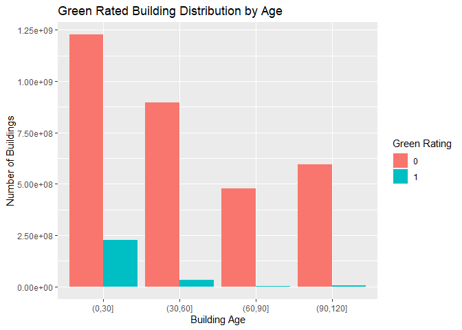
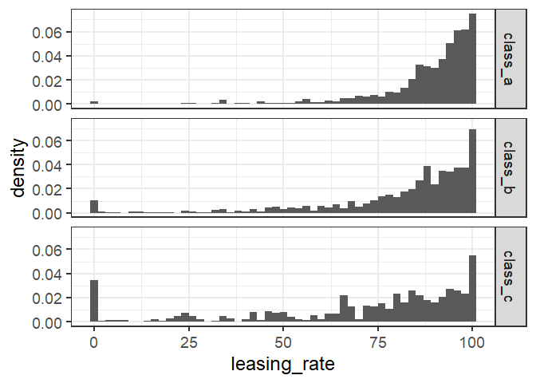
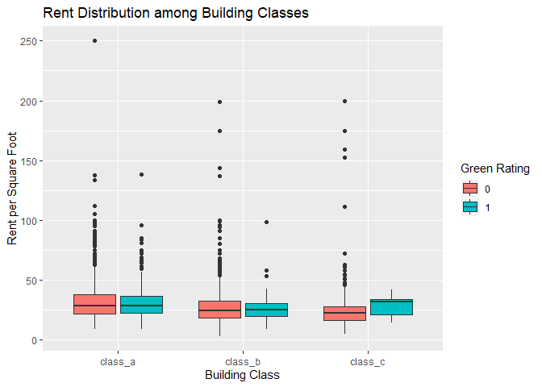
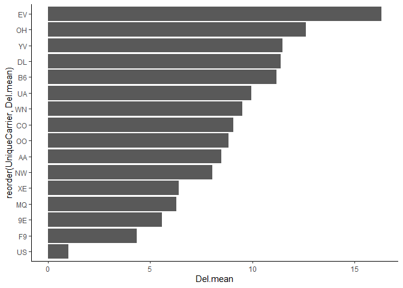
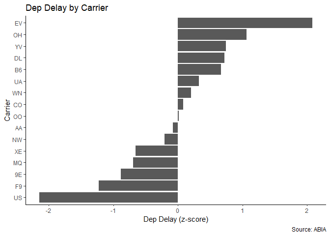
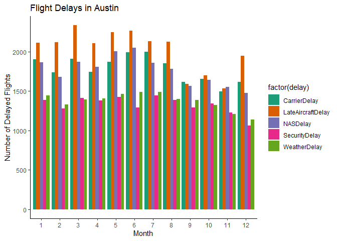
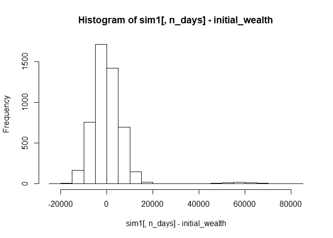
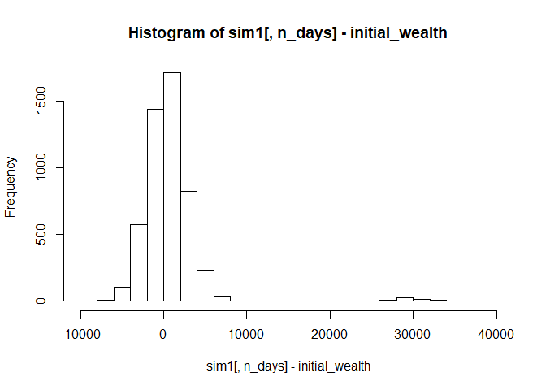
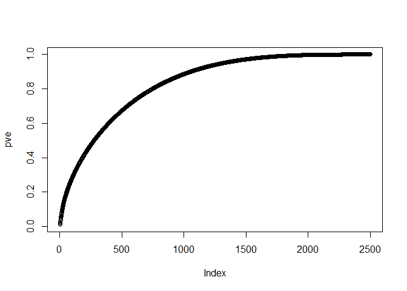

STA380 Part 2 Exercises
================
Rawini Dias, Truett Bloxsom, Mohini Agarwal, Christopher Henson

Question 1
==========

``` r
library(ggplot2)
library(tidyverse)
```

    ## -- Attaching packages ------------------------------------------- tidyverse 1.2.1 --

    ## v tibble  2.1.3     v purrr   0.3.2
    ## v tidyr   0.8.3     v dplyr   0.8.3
    ## v readr   1.3.1     v stringr 1.4.0
    ## v tibble  2.1.3     v forcats 0.4.0

    ## -- Conflicts ---------------------------------------------- tidyverse_conflicts() --
    ## x dplyr::filter() masks stats::filter()
    ## x dplyr::lag()    masks stats::lag()

``` r
library(dplyr)
library(tidyr)
```

``` r
buildings = read.csv("../../data/greenbuildings.csv")
```

CLEANING THE DATA 1) Missing data

``` r
sum(is.na(buildings))
```

    ## [1] 74

``` r
#Very few rows where empl_gr is missing
buildings = na.omit(buildings)
```

1.  Factorizing categorical columns

``` r
#Factorizing categorical columns
buildings$renovated = factor(buildings$renovated)
buildings$class_a = factor(buildings$class_a)
buildings$class_b = factor(buildings$class_b)
buildings$LEED = factor(buildings$LEED)
buildings$Energystar = factor(buildings$Energystar)
buildings$green_rating = factor(buildings$green_rating)
buildings$net = factor(buildings$net)
buildings$amenities = factor(buildings$amenities)
```

EXPLORATORY DATA ANALYSIS

Green Rated Building Distribution by Age:

``` r
buildAgeDist = buildings %>%
  mutate(agecat = cut(age, c(0, 30,60,90,120)))

buildAgeDist = na.omit(buildAgeDist)

buildAgeDist = buildAgeDist %>%
  group_by(green_rating,agecat) %>%
  summarize(buildCount = sum(CS_PropertyID))

ggplot(data = buildAgeDist) + 
  geom_bar(mapping = aes(x=agecat, y=buildCount,
                         fill=factor(green_rating)),
           stat='identity', position ='dodge') + 
  labs(title="Green Rated Building Distribution by Age", 
       y="Number of Buildings",
       x = "Building Age",
       fill="Green Rating")
```



Green rated building are newer on average.

Green Rated Building Distribution by Building Class:

``` r
#create column for class_c
buildings$class_c = 0
buildings[buildings$class_a==0 & buildings$class_b==0,]$class_c = 1
 
#combine all classes into one categorical column
buildings$class = names(buildings[c('class_a','class_b','class_c')])[max.col(buildings[c('class_a','class_b','class_c')])]
buildings$class = factor(buildings$class)

ggplot(buildings,aes(class)) +
  geom_bar(aes(fill=green_rating),position = 'dodge') +
  labs(title="Green Rated Building Distribution by Class", 
       y="Number of Buildings",
       x = "Building Class",
       fill="Green Rating")
```


Most green rated buildings are also class A buildings. (Class C has only 7 green rated buildings)

``` r
nrow(buildings[(buildings$class_c == 1) & (buildings$green_rating == 1),])
```

    ## [1] 7

There are only 7 Class C green rated buildings, which is too small a sample to trust any results for green-rated class C buildings - therefore, we will not focus on class C green rated buildings for the rest of this analysis.

Leasing Rate Distribution by Building Class:

``` r
ggplot(data=buildings) + 
  geom_histogram(aes(x=leasing_rate, stat(density)), binwidth=2) + 
  facet_grid(class~.) +
  theme_bw(base_size=18)
```



Class A buildings have the highest leasing rate, then Class B, and Class C has a large number of buildings at a leasing rate of 0%.

Rent Distribution among Building Classes:

``` r
ggplot(buildings,aes(x=factor(class),y=Rent)) +
  geom_boxplot(aes(fill=factor(green_rating))) +
  labs(title="Rent Distribution among Building Classes", 
       y="Rent per Square Foot",
       x = "Building Class",
       fill="Green Rating")
```



``` r
#Numeric analysis to get median rent of class A and B, green vs non-green
x1=subset(buildings,(green_rating == 0 & class_a==1))
nongreen_A_rent = median(x1[,5])
x2=subset(buildings,(green_rating == 1 & class_a==1))
green_A_rent = median(x2[,5])

y1=subset(buildings,(green_rating == 0 & class_b==1))
nongreen_B_rent = median(y1[,5])
y2=subset(buildings,(green_rating == 1 & class_b==1))
green_B_rent = median(y2[,5])

sprintf("Median rent for non-green class A is %f", nongreen_A_rent)
```

    ## [1] "Median rent for non-green class A is 28.200000"

``` r
sprintf("Median rent for green class A is %f", green_A_rent)
```

    ## [1] "Median rent for green class A is 28.440000"

``` r
sprintf("Median rent for non-green class B is %f", nongreen_B_rent)
```

    ## [1] "Median rent for non-green class B is 24.000000"

``` r
sprintf("Median rent for green class B is %f", green_B_rent)
```

    ## [1] "Median rent for green class B is 25.100000"

Based on the above box and whisker plots, median rent of Class A green rated and non-green rated buildings appear to be the same. Median rent of Class B green rated buildings seems to be slightly higher than its non-green rated buildings.
Therefore, it is apparent that green rating by itself does not imply that the building can charge a higher rent per square foot.

Repeat above plot for only buildings with leasing rate &gt; 50%

``` r
occupied = filter(buildings, leasing_rate > 50)

ggplot(occupied,aes(x=factor(class),y=Rent)) +
  geom_boxplot(aes(fill=factor(green_rating))) +
  labs(title="Rent Distribution among Building with High Occupancy", 
       y="Rent per Square Foot",
       x = "Building Class",
       fill="Green Rating")
```


At a leasing rate of greater than 50%, we see a similar trend as before, with median rent for green rated vs non-green rated for Class A and B been almost equal.

Rent Distribution among Renovated Buildings by Building Class:

``` r
renovated = filter(buildings, renovated == 1)

ggplot(renovated,aes(x=factor(class),y=Rent)) +
  geom_boxplot(aes(fill=factor(green_rating))) +
  labs(title="Rent Distribution among Renovated Buildings", 
       y="Rent per Square Foot",
       x = "Building Class",
       fill="Green Rating")
```


From the renovated buildings, green rated class A buildings has a higher median rent than non-green class A buildings. However, for class B renovated buildings, those that are green rated have a LOWER median rent than those that are not green rated.

Rent Distribution among UN-Renovated Buildings by Building Class:

``` r
renovated = filter(buildings, renovated == 0)

ggplot(renovated,aes(x=factor(class),y=Rent)) +
  geom_boxplot(aes(fill=factor(green_rating))) +
  labs(title="Rent Distribution among Unrenovated Buildings", 
       y="Rent per Square Foot",
       x = "Building Class",
       fill="Green Rating")
```


It is interesting to see that for Class A unrenovated buildings, those that are green rated have a LOWER median rent than those that are not green rated.

Rent Distribution based on Ameneties:

``` r
#Rent based on ameneties
ggplot(buildings,aes(x=factor(class),y=Rent)) +
  geom_boxplot(aes(fill=factor(amenities))) +
  labs(title="Rent Distribution based on Presence of Ameneties", 
       y="Rent per Square Foot",
       x = "Building Class",
       fill="Amenities")
```


It is interesting to see that buildings that have amenities have a lower median rent per square foot in buildings belonging to classes A, B, and C.

Electricity Cost Comparison:

``` r
#Electricity Costs based on green rating
ggplot(buildings,aes(x=factor(class),y=Electricity_Costs)) +
  geom_boxplot(aes(fill=factor(green_rating))) +
  labs(title="Electricity Costs Distribution", 
       y="Electricity Costs",
       x = "Building Class",
       fill="Green Rating")
```


Class A green rated buildings does seem to have a lower median electricity cost, however, its interquartile range for electricity cost is similar to the non-green rated Class A buildings The median and 3rd quartile for class B green rated buildings are equal suggesting higher electricity costs for class B green rated buildings.

Gas Cost Comparison:

``` r
#Gas Costs based on green rating
ggplot(buildings,aes(x=factor(class),y=Gas_Costs)) +
  geom_boxplot(aes(fill=factor(green_rating))) +
  labs(title="Gas Costs Distribution", 
       y="Gas Costs",
       x = "Building Class",
       fill="Green Rating")
```


It looks like there is not a lot of variation in median gas costs amongst the buildings.

Conclusion: The data does not support the 'Excel guru's' conclusion that they can charge an extra 2.60 of rent per square foot on their green-rated building compared to the market rate. The data only shows a $0.24 median increase in rent among the current green rated class A buildings compared to non-green class A buildings. The data only shows a 1.10 median increase in rent among the current green rated class B buildings compared to non-green class B buildings. Additionally, we can see that several other factors explored above, such as ameneties, leasing rate, building renovation, all play a role in determining the rent that can be charged.

Question 2
==========

``` r
library("tidyverse")
ABIA <- read.csv("../../data/ABIA.csv")
ABIA[is.na(ABIA)] = 0
```

``` r
ABIA$date <- as.Date(with(ABIA, paste(Year, Month, DayofMonth,sep="-")), "%Y-%m-%d")
```

``` r
theme_set(theme_classic())
g <- ggplot(ABIA, aes(x=(UniqueCarrier), DepDelay))
g + geom_boxplot(fill="plum", outlier.shape = NA) + 
  scale_y_continuous(limits = quantile(ABIA$DepDelay, c(0.1, 0.9))) +
    labs(title="Box plot", 
         subtitle="Dep Delay grouped by Carrier",
         caption="Source: ABIA",
         x="Carrier",
         y="Departure Delay")
```

 Most of the carriers's flights depart on average on or before the scheduled departure time.

``` r
theme_set(theme_classic())
g <- ggplot(ABIA, aes(UniqueCarrier, DepDelay))
g + geom_violin(fill="plum", outlier.shape = NA) + 
  scale_y_continuous(limits = quantile(ABIA$DepDelay, c(0.1, 0.9))) +
    labs(title="Violin plot", 
         subtitle="Dep Delay grouped by Carrier",
         caption="Source: ABIA",
         x="Carrier",
         y="Departure Delay")
```


The violin plot shows that some carriers are stingy when it comes to when the flight departs. Carriers OH and YV like their flights to depart right on time instead of early.

``` r
ABIA_summ = ABIA %>%
  group_by(UniqueCarrier)  %>%  # group the data points by model name
  summarize(Del.mean = mean(DepDelay))  # calculate a mean for each model
```

``` r
# reorder the x labels
ggplot(ABIA_summ, aes(x=reorder(UniqueCarrier, Del.mean), y=Del.mean)) + 
  geom_bar(stat='identity') + 
  coord_flip()
```



``` r
# first add a new column using the mutate function
ABIA_summ = mutate(ABIA_summ, Del.z = (Del.mean - mean(Del.mean))/sd(Del.mean))

# now plot the newly defined variable
ggplot(ABIA_summ, aes(x=reorder(UniqueCarrier, Del.z), y=Del.z)) + 
  geom_bar(stat='identity') + 
  labs(title="Dep Delay by Carrier", 
       caption="Source: ABIA",
       y="Dep Delay (z-score)",
       x = "Carrier") + 
  coord_flip()
```



This shows that Carrier EV has the highest average departure delay of any carrier and US has the lowest average departure delay of any carrier.

``` r
ABIA$delay = names(ABIA[c('CarrierDelay','WeatherDelay','NASDelay','SecurityDelay','LateAircraftDelay')])[max.col(ABIA[c('CarrierDelay','WeatherDelay','NASDelay','SecurityDelay','LateAircraftDelay')])]
ABIA$delay = factor(ABIA$delay)
```

``` r
ABIA$Month = factor(ABIA$Month)
ABIA$DayOfWeek = factor(ABIA$DayOfWeek)
```

``` r
ggplot(ABIA,aes(factor(Month))) +
  geom_bar(aes(fill=factor(delay)), position = 'dodge') +
  labs(title="Flight Delays in Austin", 
       y="Number of Delayed Flights",
       x = "Month") + scale_fill_brewer(palette="Dark2")
```



There seems to be less overall flight delays during September, October, and November. Most flight delays are caused by late aircraft.

``` r
ggplot(ABIA,aes(factor(DayOfWeek))) +
  geom_bar(aes(fill=factor(delay)), position = 'dodge') +
  labs(title="Flight Delays in Austin", 
       y="Number of Delayed Flights",
       x = "Day of the Week (1: Monday)") + scale_fill_brewer(palette="Dark2")
```


There seems to be significantly less aircraft delays on Saturdays. Once again, most aircraft delays are due to late aircraft.

Question 3
==========

``` r
library(mosaic)
library(quantmod)
library(foreach)
```

``` r
#### Now use a bootstrap approach
#### With more stocks

mystocks = c("IWR", "LQD", "VWO", "USO", "VNQI")
myprices = getSymbols(mystocks, from = "2014-01-01")
```

    ## 'getSymbols' currently uses auto.assign=TRUE by default, but will
    ## use auto.assign=FALSE in 0.5-0. You will still be able to use
    ## 'loadSymbols' to automatically load data. getOption("getSymbols.env")
    ## and getOption("getSymbols.auto.assign") will still be checked for
    ## alternate defaults.
    ## 
    ## This message is shown once per session and may be disabled by setting 
    ## options("getSymbols.warning4.0"=FALSE). See ?getSymbols for details.

IWR = Largest All Cap Equities ETF = All cap equities ETFs are funds that invest in equities of all market capitalizations. These funds may include micro cap, small cap, mid cap or large cap stocks. This ETF is one of several ETFs available that offers exposure to mid cap U.S. stocks, an asset class that can make up a significant portion of long-term, buy-and-hold portfolios. As such, this ETF may be more appealing to those in the portfolio construction process as opposed to short term traders. Mid cap stocks are appealing to many because they still have significant growth potential but they are less risky than their small and micro cap brethren = mid risk

LQD = Largest Corporate Bonds ETF = Corporate bonds ETFs invest in debt issued by corporations with investment-grade credit ratings. Bonds included in these funds can feature varying maturities and are issued by companies from multiple industries. This ETF is the most popular option for investors looking to gain exposure to investment grade corporate bonds, making it a useful tool for those looking to access a corner of the bond market that should be a core component of any long-term, buy-and-hold portfolio = Safe

VWO = Largest Emerging Markets Equities ETF = Leveraged ETFs allow investors to boost returns on an index by using financial derivatives and debt. These ETFs are available for most indices such as the S&P 500 and the NASDAQ composite, and deliver returns in multiples of the underlying index. this fund can be used as a short-term trading vehicle or as a core holding in a long-term, buy-and-hold portfolio. It should be noted, however, that VWO tends to attract longer-term investors = Safe

USO = Largest Oil & Gas ETF = Oil & Gas ETFs invest directly in oil or gas and/or their subsidiary commodities. Note that these funds almost always utilize futures exposure to invest in their respective commodities. This fund offers exposure to one of the the world's most important commodities, oil, and potentially has appeal as an inflation hedge. While oil may be appealing, USO often suffers from severe contango making the product more appropriate for short-term traders = risky

VNQI = Largest Global Real Estate ETF = Global Real Estate ETFs invest in real estate companies from all over the world. These ETFs can offer broad exposure to the industry, or can target specific subsectors such as residential property. In addition, some of these funds focus on the global ex-U.S. market, while others target a specific region or country. As such, VNQI has the potential to deliver broad-based access to an asset class that can deliver attractive current returns and significant appreciation for long term capital appreciation (along with meaningful volatility and risk) = mid risk

``` r
# A chunk of code for adjusting all stocks
# creates a new object adding 'a' to the end
# For example, WMT becomes WMTa, etc
for(ticker in mystocks) {
    expr = paste0(ticker, "a = adjustOHLC(", ticker, ")")
    eval(parse(text=expr))
}

#head(IWRa)
```

``` r
# Combine all the returns in a matrix
all_returns = cbind(    ClCl(IWRa),
                                ClCl(LQDa),
                                ClCl(VWOa),
                                ClCl(USOa),
                                ClCl(VNQIa))
#head(all_returns)
all_returns = as.matrix(na.omit(all_returns))
```

Portfolio 1
-----------

``` r
set.seed(1)
# Now simulate many different possible scenarios  
initial_wealth = 100000
sim1 = foreach(i=1:5000, .combine='rbind') %do% {
    total_wealth = initial_wealth
    weights = c(0.2, 0.2, 0.2, 0.2, 0.2)
    holdings = weights * total_wealth
    n_days = 20
    wealthtracker = rep(0, n_days)
    for(today in 1:n_days) {
        return.today = resample(all_returns, 1, orig.ids=FALSE)
        holdings = holdings + holdings*return.today
        total_wealth = sum(holdings)
        holdings = weights * total_wealth
        wealthtracker[today] = total_wealth
    }
    wealthtracker
}

#head(sim1)
#hist(sim1[,n_days], 30)

# Profit/loss
cat("mean profit/loss =", mean(sim1[,n_days]),"\n")
```

    ## mean profit/loss = 101018.3

``` r
hist(sim1[,n_days]- initial_wealth, breaks=30)
```


``` r
# bootstrapped standard errors
cat("standard error =",sd(sim1), "\n")
```

    ## standard error = 5631.977

``` r
#VaR
quantile(sim1[,n_days]- initial_wealth, 0.05)
```

    ##       5% 
    ## -5567.97

Portfolio 2
-----------

``` r
set.seed(1)
# Now simulate many different possible scenarios  
initial_wealth = 100000
sim1 = foreach(i=1:5000, .combine='rbind') %do% {
    total_wealth = initial_wealth
    weights = c(0.2, 0.05, 0.05, 0.5, 0.2)
    holdings = weights * total_wealth
    n_days = 20
    wealthtracker = rep(0, n_days)
    for(today in 1:n_days) {
        return.today = resample(all_returns, 1, orig.ids=FALSE)
        holdings = holdings + holdings*return.today
        total_wealth = sum(holdings)
        holdings = weights * total_wealth
        wealthtracker[today] = total_wealth
    }
    wealthtracker
}

#head(sim1)
#hist(sim1[,n_days], 25)

# Profit/loss
mean(sim1[,n_days])
```

    ## [1] 100577

``` r
#hist(sim1[,n_days]- initial_wealth, breaks=30)

# Profit/loss
cat("mean profit/loss =", mean(sim1[,n_days]),"\n")
```

    ## mean profit/loss = 100577

``` r
hist(sim1[,n_days]- initial_wealth, breaks=30)
```



``` r
# bootstrapped standard errors
cat("standard error =",sd(sim1), "\n")
```

    ## standard error = 6468.702

``` r
#VaR
quantile(sim1[,n_days]- initial_wealth, 0.05)
```

    ##        5% 
    ## -9025.216

Portfolio 3
-----------

``` r
set.seed(1)
# Now simulate many different possible scenarios  
initial_wealth = 100000
sim1 = foreach(i=1:5000, .combine='rbind') %do% {
    total_wealth = initial_wealth
    weights = c(0.1, 0.5, 0.25, 0.05, 0.1)
    holdings = weights * total_wealth
    n_days = 20
    wealthtracker = rep(0, n_days)
    for(today in 1:n_days) {
        return.today = resample(all_returns, 1, orig.ids=FALSE)
        holdings = holdings + holdings*return.today
        total_wealth = sum(holdings)
        holdings = weights * total_wealth
        wealthtracker[today] = total_wealth
    }
    wealthtracker
}

#head(sim1)
#hist(sim1[,n_days], 25)

# Profit/loss
mean(sim1[,n_days])
```

    ## [1] 100788.4

``` r
#hist(sim1[,n_days]- initial_wealth, breaks=30)

# Profit/loss
cat("mean profit/loss =", mean(sim1[,n_days]),"\n")
```

    ## mean profit/loss = 100788.4

``` r
hist(sim1[,n_days]- initial_wealth, breaks=30)
```



``` r
# bootstrapped standard errors
cat("standard error =",sd(sim1), "\n")
```

    ## standard error = 2972.292

``` r
#VaR
quantile(sim1[,n_days]- initial_wealth, 0.05)
```

    ##        5% 
    ## -3187.901

Portflio 1 was intended to be a mid risk, diverse portfolio both in terms of weight for each stock and the stocks themselves. We choose 1 high risk stock (USO), two mid risk (IWR, VNQI), and two safe stocks (LQD, VWO). These stocks also range from emerging markets ETFs (very diverse) to Oil and Gas ETFs (very specialized). The weights for Portfilio 1 where all equal to eachother.

Portfolio 2 was intended to be a risky, semi-deverse portfolio. More weight was given to the risky ETF (USO) and some to the mid risk ETFs and little weight to safe ETFs.

Portfolio 3 was intended to be a safe, diverse portfolio with most of the weight given to the safe ETFs and less given to the risky or mid-risk ETFs.

The results show that Porfolio 3 had the lowest VaR at -3,187, with Portfolio 1 coming in second at -5,567, and Portfolio 2 was the riskiest with a VaR of -9,025. So our weights and chosen ETFs worked as intended in terms of risk. Another thing to note is that Portfolio 1 on average gained the most value over the other Portfolios.

The distributions of earnings are all normal but have a significant outlier in the positive direction. This seemed odd, but under further inspection, it seems that the IWR ETF had some incredibly good earnings on Oct. 21st 2016 with a jump from 41 dollars to 170 dollars in one day! But on the very next day, IWR went back down to $41. So based on the weights, the boostrap sampled that day muiltiple times and since Portfolio 1 had the highest weight for IWR, the outlier was more pronounced than the other portfolios. This could be viewed as a flaw of the boostrap method for choosing assest allocations.

Question 4
==========

``` r
library(factoextra)
```

    ## Welcome! Related Books: `Practical Guide To Cluster Analysis in R` at https://goo.gl/13EFCZ

``` r
library(plotly)
```

    ## 
    ## Attaching package: 'plotly'

    ## The following object is masked from 'package:mosaic':
    ## 
    ##     do

    ## The following object is masked from 'package:ggplot2':
    ## 
    ##     last_plot

    ## The following object is masked from 'package:stats':
    ## 
    ##     filter

    ## The following object is masked from 'package:graphics':
    ## 
    ##     layout

``` r
library(LICORS)
```

K means:

``` r
social_marketing = read.csv("../../data/social_marketing.csv", header = TRUE, row.names = 1)
```

``` r
social_marketing$sum = rowSums(social_marketing)

social_marketing = social_marketing[ social_marketing$sum > 25,  ]
social_marketing$sum = NULL

social_marketing = social_marketing / rowSums(social_marketing)
social_marketing = social_marketing * 100
```

``` r
scaled = scale(social_marketing, center=TRUE, scale=TRUE)
clust_num = 10
set.seed(1)
clust = kmeanspp(scaled, k=clust_num, nstart=100)
```

``` r
for (i in 1:clust_num){
  assign(paste('cluster', i, sep = '_'), colMeans(social_marketing[which(clust$cluster == i),]))
}
```

``` r
means = data.frame(do.call(rbind, mget(ls(pattern="^cluster\\_\\d+"))))
#means = means * 100
```

``` r
means[ apply(means, 1, max) > 20, ]
```

    ##             chatter current_events   travel photo_sharing uncategorized
    ## cluster_1  9.464215       3.722318 4.211237      4.391680      2.211526
    ## cluster_2 22.053345       4.822325 2.689313     13.218867      1.996305
    ## cluster_5  7.650586       3.161374 2.478067      4.279564      1.880478
    ##            tv_film sports_fandom politics     food   family
    ## cluster_1 1.597180      2.878415 2.909411 2.570712 2.227161
    ## cluster_2 1.828449      2.773351 3.229758 1.824596 1.977275
    ## cluster_5 1.565793      2.070419 2.072082 3.885278 1.336139
    ##           home_and_garden    music     news online_gaming shopping
    ## cluster_1        1.434745 1.290815 2.232524      2.180850 1.988649
    ## cluster_2        1.362976 1.783873 1.415653      1.600887 8.741066
    ## cluster_5        1.101366 1.310702 1.891536      1.652822 2.256817
    ##           health_nutrition college_uni sports_playing  cooking      eco
    ## cluster_1         3.135399    2.259088      0.9154846 2.408023 1.582185
    ## cluster_2         2.783370    2.520667      1.2578700 2.312371 1.639105
    ## cluster_5        21.901698    1.658014      1.1309516 5.973493 1.535260
    ##           computers  business  outdoors   crafts automotive       art
    ## cluster_1 1.6498048 0.6522555 2.3660792 1.215372   2.217233 1.6250173
    ## cluster_2 1.3542751 1.3975967 0.9461259 1.184657   2.135009 0.8905267
    ## cluster_5 0.9814402 0.7642707 4.7630644 1.018884   1.049197 1.1484331
    ##           religion    beauty parenting    dating    school
    ## cluster_1 1.581265 1.0771657  2.204632 1.0308190 1.6667243
    ## cluster_2 1.171794 0.7478535  1.290339 0.8668087 1.4816626
    ## cluster_5 1.345077 0.7822271  1.293904 1.4568339 0.9715465
    ##           personal_fitness  fashion small_business        spam      adult
    ## cluster_1         2.551507 1.469916      1.2644200 0.495347105 21.3208262
    ## cluster_2         1.991000 1.409498      0.9440442 0.000000000  0.3573862
    ## cluster_5        11.532114 1.262572      0.4635387 0.003100955  0.3713570

``` r
means[ apply(means, 1, max) < 15, ]
```

    ##            chatter current_events   travel photo_sharing uncategorized
    ## cluster_3 7.323138       3.345225 2.403059      4.084620      1.461889
    ## cluster_6 8.541926       4.413056 4.361579      5.085641      3.171853
    ## cluster_9 8.863629       3.578949 2.582574      4.173345      1.644402
    ##             tv_film sports_fandom  politics     food   family
    ## cluster_3  1.716835     10.708184  1.818317 8.285562 4.558409
    ## cluster_6 11.024176      2.784592  2.827874 3.119178 1.373233
    ## cluster_9  2.239365      6.670243 11.447518 2.353806 2.310874
    ##           home_and_garden    music      news online_gaming shopping
    ## cluster_3        1.200219 1.287255  1.503730      1.627938 2.199124
    ## cluster_6        1.641677 4.068994  2.164281      1.241690 2.885456
    ## cluster_9        1.444513 1.373816 13.899527      1.817755 2.054746
    ##           health_nutrition college_uni sports_playing  cooking       eco
    ## cluster_3         2.897513    1.889506       1.245313 2.328041 1.2069217
    ## cluster_6         2.701727    6.323152       1.691564 2.410635 1.1177000
    ## cluster_9         2.633318    1.918307       1.195552 2.051451 0.8597372
    ##           computers  business outdoors    crafts automotive       art
    ## cluster_3 1.2967696 0.8402610 1.120910 1.8666505   1.723200 1.2011042
    ## cluster_6 0.9085427 1.5244290 1.289701 1.9006138   1.028397 7.9831925
    ## cluster_9 0.7611240 0.7396631 2.297531 0.7509744   8.667077 0.9745691
    ##           religion    beauty parenting    dating   school personal_fitness
    ## cluster_3 9.674889 1.8281957  7.150800 0.8776596 4.687163         1.775394
    ## cluster_6 2.391736 1.2978128  1.166995 0.9437737 1.357225         1.705087
    ## cluster_9 1.596230 0.8783967  2.101061 1.1280574 1.654190         1.657648
    ##            fashion small_business spam     adult
    ## cluster_3 1.611724      0.7080248    0 0.5464554
    ## cluster_6 1.596258      1.5695889    0 0.3866649
    ## cluster_9 1.035079      0.4698988    0 0.1750717

``` r
means[means$health_nutrition < 2.75,]
```

    ##             chatter current_events    travel photo_sharing uncategorized
    ## cluster_10 7.223711       3.083369 14.878964      3.747103      1.348699
    ## cluster_6  8.541926       4.413056  4.361579      5.085641      3.171853
    ## cluster_9  8.863629       3.578949  2.582574      4.173345      1.644402
    ##              tv_film sports_fandom  politics     food   family
    ## cluster_10  1.808022      2.020925 18.392983 2.882625 1.401091
    ## cluster_6  11.024176      2.784592  2.827874 3.119178 1.373233
    ## cluster_9   2.239365      6.670243 11.447518 2.353806 2.310874
    ##            home_and_garden    music      news online_gaming shopping
    ## cluster_10       0.9350043 1.100898  6.066890      1.244372 1.923591
    ## cluster_6        1.6416769 4.068994  2.164281      1.241690 2.885456
    ## cluster_9        1.4445133 1.373816 13.899527      1.817755 2.054746
    ##            health_nutrition college_uni sports_playing  cooking       eco
    ## cluster_10         2.560595    2.361562       1.170831 2.026225 1.0690676
    ## cluster_6          2.701727    6.323152       1.691564 2.410635 1.1177000
    ## cluster_9          2.633318    1.918307       1.195552 2.051451 0.8597372
    ##            computers  business outdoors    crafts automotive       art
    ## cluster_10 6.5999273 1.3704998 1.207338 1.1545055   1.045339 0.7830327
    ## cluster_6  0.9085427 1.5244290 1.289701 1.9006138   1.028397 7.9831925
    ## cluster_9  0.7611240 0.7396631 2.297531 0.7509744   8.667077 0.9745691
    ##            religion    beauty parenting    dating    school
    ## cluster_10 1.984112 0.7105320  1.503602 1.6903679 0.8961114
    ## cluster_6  2.391736 1.2978128  1.166995 0.9437737 1.3572253
    ## cluster_9  1.596230 0.8783967  2.101061 1.1280574 1.6541901
    ##            personal_fitness  fashion small_business        spam     adult
    ## cluster_10         1.625974 1.031256      0.8639631 0.003207596 0.2837044
    ## cluster_6          1.705087 1.596258      1.5695889 0.000000000 0.3866649
    ## cluster_9          1.657648 1.035079      0.4698988 0.000000000 0.1750717

``` r
means[means$personal_fitness < 1.75,]
```

    ##             chatter current_events    travel photo_sharing uncategorized
    ## cluster_10 7.223711       3.083369 14.878964      3.747103      1.348699
    ## cluster_4  7.728062       2.842543  2.800026      4.720825      1.414335
    ## cluster_6  8.541926       4.413056  4.361579      5.085641      3.171853
    ## cluster_9  8.863629       3.578949  2.582574      4.173345      1.644402
    ##              tv_film sports_fandom  politics     food   family
    ## cluster_10  1.808022      2.020925 18.392983 2.882625 1.401091
    ## cluster_4   2.295227      2.393345  2.026878 2.141258 1.926070
    ## cluster_6  11.024176      2.784592  2.827874 3.119178 1.373233
    ## cluster_9   2.239365      6.670243 11.447518 2.353806 2.310874
    ##            home_and_garden    music      news online_gaming shopping
    ## cluster_10       0.9350043 1.100898  6.066890      1.244372 1.923591
    ## cluster_4        1.0567967 1.118788  1.327471     18.632801 1.870955
    ## cluster_6        1.6416769 4.068994  2.164281      1.241690 2.885456
    ## cluster_9        1.4445133 1.373816 13.899527      1.817755 2.054746
    ##            health_nutrition college_uni sports_playing  cooking       eco
    ## cluster_10         2.560595    2.361562       1.170831 2.026225 1.0690676
    ## cluster_4          2.981650   18.900556       4.668243 2.278526 0.8364272
    ## cluster_6          2.701727    6.323152       1.691564 2.410635 1.1177000
    ## cluster_9          2.633318    1.918307       1.195552 2.051451 0.8597372
    ##            computers  business outdoors    crafts automotive       art
    ## cluster_10 6.5999273 1.3704998 1.207338 1.1545055   1.045339 0.7830327
    ## cluster_4  0.8968400 0.6335197 1.055209 0.9480462   1.543083 2.0068747
    ## cluster_6  0.9085427 1.5244290 1.289701 1.9006138   1.028397 7.9831925
    ## cluster_9  0.7611240 0.7396631 2.297531 0.7509744   8.667077 0.9745691
    ##            religion    beauty parenting    dating    school
    ## cluster_10 1.984112 0.7105320  1.503602 1.6903679 0.8961114
    ## cluster_4  1.165841 0.5713605  1.175720 1.0910012 0.8228362
    ## cluster_6  2.391736 1.2978128  1.166995 0.9437737 1.3572253
    ## cluster_9  1.596230 0.8783967  2.101061 1.1280574 1.6541901
    ##            personal_fitness  fashion small_business        spam     adult
    ## cluster_10         1.625974 1.031256      0.8639631 0.003207596 0.2837044
    ## cluster_4          1.620593 1.273406      0.7070570 0.002214839 0.5256127
    ## cluster_6          1.705087 1.596258      1.5695889 0.000000000 0.3866649
    ## cluster_9          1.657648 1.035079      0.4698988 0.000000000 0.1750717

``` r
for (i in 1:clust_num){
  len = length(which(clust$cluster == i))
  cat("Cluster", i, "has" , len, "members\n")
}
```

    ## Cluster 1 has 179 members
    ## Cluster 2 has 1039 members
    ## Cluster 3 has 831 members
    ## Cluster 4 has 430 members
    ## Cluster 5 has 1008 members
    ## Cluster 6 has 516 members
    ## Cluster 7 has 635 members
    ## Cluster 8 has 233 members
    ## Cluster 9 has 458 members
    ## Cluster 10 has 433 members

To indentify market segments for NutrientH20 we performed clustering. We experimented with different cluster sizes and methods, deciding that k-means with 10 clusters provided the clearest interpretation.

To preprocess our data, we first removed all users whoose volume of tweets fell in the botomn quartile of our data set. With such a low volume of tweets, trends were difficult to indentify, and we reccomend that they be delivered generic marketing. After removing these users, we converted our data for each user to percentage of tweets for each category.

For the rest of our considered users, several trends became apparent:

Cluster 1:

This cluster of 179 users had an average of 21% of tweets categorized as adult material. We believe these are likely pornography accounts/bots.

Cluster 2:

This cluster of 1039 users had an average of 22% of tweets categorized as chatter. We believe that this category may have been overused as a substitute for uncategorized tweets, and that generic marketing is sufficient for this segment.

Cluster 5:

This cluster of 1008 users had an average of 21% of tweets categorized as health\_nutrition. Furthermore, looking at the below plot shows that this cluster also has a correlated interest in personal fitness. We reccomend marketing that caters to these interests and consider this our most general target audience.

``` r
knitr::include_graphics("charts/plotly1.png")
```


Clusters 3 and 7:

These clusters of 635 and 831 users respectively have a moderate focus on cooking and food. Furthermore, looking at a plot of these two categories reveals that our target audience with a focus on health\_nutrition and personal fitness lies at the intersection of interest in cooking and food, another potential marketing method that would span several market segmentations.

``` r
knitr::include_graphics("charts/plotly2.png")
```


Clusters 6, 9, and 10:

These clusters of 1407 users display a low percentage of both the personal\_fitness and health\_nutrition category (&lt;2.75% health\_nutrition, &lt;1.75 personal\_fitness). We believe that marketing to these groups should focus on incorporate some other aspect with a high tweet volume. As an example, these clusters have moderate focuses on politics and news that indicate that an article written from a reputable news source on the product benefits may work well as a marketing tool.

Question 5
==========

``` r
test.documents = read.csv("../../data/ReutersC50/test_documents3.csv", header = TRUE, row.names = 1)
test.bigrams = read.csv("../../data/ReutersC50/test_bigrams3.csv", header = TRUE, row.names = 1)

train.documents = read.csv("../../data/ReutersC50/train_documents3.csv", header = TRUE, row.names = 1)
train.bigrams = read.csv("../../data/ReutersC50/train_bigrams3.csv", header = TRUE, row.names = 1)


train.bigrams = train.bigrams + .001
test.bigrams = test.bigrams + .001
```

Start here:

``` r
N = nrow(train.bigrams)
D = ncol(train.bigrams)

# TF weights
TF_mat = train.bigrams/rowSums(train.bigrams)
# IDF weights
IDF_vec = log(1 + N/colSums(train.bigrams > 0))
# TF-IDF weights:
# use sweep to multiply the columns (margin = 2) by the IDF weights
TFIDF_mat = sweep(TF_mat, MARGIN=2, STATS=IDF_vec, FUN="*")
```

``` r
# PCA on the TF-IDF weights
pca = prcomp(TFIDF_mat, scale=TRUE)
pve = summary(pca)$importance[3,]
plot(pve)  # not much of an elbow
```



``` r
X = pca$x[,1:1000]
y = {train.documents$author}
```

Now do the PCA for test set and predict:

``` r
N = nrow(test.bigrams)
D = ncol(test.bigrams)

#remove 0 row sums
test.bigrams = test.bigrams[rowSums(test.bigrams) != 0,]
test.documents = test.documents[row.names(test.bigrams),]
#remove 0 col sums
test.bigrams = test.bigrams[,colSums(test.bigrams) != 0]

# TF weights
TF_mat = test.bigrams/rowSums(test.bigrams)
# IDF weights
IDF_vec = log(1 + N/colSums(test.bigrams > 0))
# TF-IDF weights:
# use sweep to multiply the columns (margin = 2) by the IDF weights
TFIDF_mat = sweep(TF_mat, MARGIN=2, STATS=IDF_vec, FUN="*")  

# PCA on the TF-IDF weights
pca = prcomp(TFIDF_mat, scale=TRUE)
pve = summary(pca)$importance[3,]
plot(pve)  # not much of an elbow
```


``` r
Xtest = pca$x[,1:1000]
ytest = {test.documents$author}
```

``` r
library(randomForest)
```

    ## randomForest 4.6-14

    ## Type rfNews() to see new features/changes/bug fixes.

    ## 
    ## Attaching package: 'randomForest'

    ## The following object is masked from 'package:dplyr':
    ## 
    ##     combine

    ## The following object is masked from 'package:ggplot2':
    ## 
    ##     margin

``` r
finrf = randomForest(x = X, y = y, ntree=500)
```

``` r
pred = predict(finrf, newx = Xtest, newy = ytest)
```

``` r
comp = data.frame(cbind(as.character(pred), as.character(ytest)))
names(comp) = c('predicted', 'actual')
comp$correct = comp$predicted == comp$actual
```

``` r
cat('Test set accuracy:', length(which(comp$correct))/2500)
```

    ## Test set accuracy: 0.816

``` r
source("http://pcwww.liv.ac.uk/~william/R/crosstab.r")
tab = crosstab(comp, row.vars = "predicted", col.vars = "actual", type = "f")
write.csv(tab$crosstab, '../tab.csv')
tab = read.csv('../tab.csv', header = TRUE, row.names = 1)
```

``` r
for (i in 1:50){
  cat(as.character(tab[i,i]/.5),'%', ' accuracy predicting ', names(tab)[i], '\n', sep = '')
}
```

    ## 94% accuracy predicting AaronPressman
    ## 86% accuracy predicting AlanCrosby
    ## 66% accuracy predicting AlexanderSmith
    ## 70% accuracy predicting BenjaminKangLim
    ## 82% accuracy predicting BernardHickey
    ## 76% accuracy predicting BradDorfman
    ## 86% accuracy predicting DarrenSchuettler
    ## 88% accuracy predicting DavidLawder
    ## 78% accuracy predicting EdnaFernandes
    ## 76% accuracy predicting EricAuchard
    ## 100% accuracy predicting FumikoFujisaki
    ## 78% accuracy predicting GrahamEarnshaw
    ## 96% accuracy predicting HeatherScoffield
    ## 62% accuracy predicting JaneMacartney
    ## 92% accuracy predicting JanLopatka
    ## 100% accuracy predicting JimGilchrist
    ## 82% accuracy predicting JoeOrtiz
    ## 74% accuracy predicting JohnMastrini
    ## 80% accuracy predicting JonathanBirt
    ## 92% accuracy predicting JoWinterbottom
    ## 92% accuracy predicting KarlPenhaul
    ## 84% accuracy predicting KeithWeir
    ## 78% accuracy predicting KevinDrawbaugh
    ## 80% accuracy predicting KevinMorrison
    ## 68% accuracy predicting KirstinRidley
    ## 84% accuracy predicting KouroshKarimkhany
    ## 88% accuracy predicting LydiaZajc
    ## 98% accuracy predicting LynneO.Donnell
    ## 98% accuracy predicting LynnleyBrowning
    ## 92% accuracy predicting MarcelMichelson
    ## 90% accuracy predicting MarkBendeich
    ## 82% accuracy predicting MartinWolk
    ## 94% accuracy predicting MatthewBunce
    ## 88% accuracy predicting MichaelConnor
    ## 46% accuracy predicting MureDickie
    ## 94% accuracy predicting NickLouth
    ## 88% accuracy predicting PatriciaCommins
    ## 92% accuracy predicting PeterHumphrey
    ## 78% accuracy predicting PierreTran
    ## 88% accuracy predicting RobinSidel
    ## 94% accuracy predicting RogerFillion
    ## 62% accuracy predicting SamuelPerry
    ## 86% accuracy predicting SarahDavison
    ## 36% accuracy predicting ScottHillis
    ## 76% accuracy predicting SimonCowell
    ## 54% accuracy predicting TanEeLyn
    ## 78% accuracy predicting TheresePoletti
    ## 86% accuracy predicting TimFarrand
    ## 88% accuracy predicting ToddNissen
    ## 60% accuracy predicting WilliamKazer

Report:

Data Pipeline: The Reuters C50 corpus consists of text documents from 50 authors, for our purposes split into a training and test set of 2500 documents each (50 per author per training/test set). I first read these text files into python and performed several preprocessing steps.

First, I removed all non-alphanumeric characters and converted all text to lowercase, then used the package "nltk" to tokenize each document. I then removed all English stopwords and and performed stemming. Using pandas, I collect all of these preprocessed texts into a training and test dataframe, with each row containing three columns: the text, the author, and a category for if the document was part of the training or test set.

During this process, I also pulled information on the most common bigrams for each author. For every author, I pulled their documents from the training set and recorded their 100 most frequent bigrams. Considering duplicate bigrams between authors, this produced a list of 3165 bigrams to use an indicator of authorship. With these bigrams, I created two data frames, which counted the number of times that each of these bigrams appeared in each of our 5000 documents. For clarity: in these data frames each row represented a document, each of the 3165 columns represented the number of times a particuliar bigram appeared in the document.

Moving over to R, I read in each of these dataframes. For each of the test and training bigram dataframes of counts, I then added a small amount of noise (.001) to each observation. I then created a TF-IDF matrix for these bigrams, and ran a principal components analysis. Using the first 1000 principal components, I created a random forest model for the set of training documents. I then used this model to predict authorship for the test set with an accuracy of over 80%

Question 6
==========

``` r
library(tidyverse)
library(arules)
```

    ## 
    ## Attaching package: 'arules'

    ## The following objects are masked from 'package:mosaic':
    ## 
    ##     inspect, lhs, rhs

    ## The following object is masked from 'package:dplyr':
    ## 
    ##     recode

    ## The following objects are masked from 'package:base':
    ## 
    ##     abbreviate, write

``` r
library(arulesViz)
```

    ## Loading required package: grid

    ## Registered S3 method overwritten by 'seriation':
    ##   method         from 
    ##   reorder.hclust gclus

``` r
groceries_long = read.csv("../../data/groceries_long_form.csv", header = TRUE)
names(groceries_long) = c('Transaction', 'Item')
groceries_long$Transaction = factor(groceries_long$Transaction)
```

``` r
str(groceries_long)
```

    ## 'data.frame':    43367 obs. of  2 variables:
    ##  $ Transaction: Factor w/ 9835 levels "1","2","3","4",..: 1 1 1 1 2 2 2 3 4 4 ...
    ##  $ Item       : Factor w/ 169 levels "abrasive cleaner",..: 30 133 89 119 158 168 34 167 110 168 ...

``` r
lists = split(x=groceries_long$Item, f=groceries_long$Transaction)

## Remove duplicates ("de-dupe")
lists = lapply(lists, unique)

## Cast this variable as a special arules "transactions" class.
trans = as(lists, "transactions")
```

``` r
grocery_rules = apriori(trans, parameter=list(support=.005, confidence=.1, maxlen=5))
```

    ## Apriori
    ## 
    ## Parameter specification:
    ##  confidence minval smax arem  aval originalSupport maxtime support minlen
    ##         0.1    0.1    1 none FALSE            TRUE       5   0.005      1
    ##  maxlen target   ext
    ##       5  rules FALSE
    ## 
    ## Algorithmic control:
    ##  filter tree heap memopt load sort verbose
    ##     0.1 TRUE TRUE  FALSE TRUE    2    TRUE
    ## 
    ## Absolute minimum support count: 49 
    ## 
    ## set item appearances ...[0 item(s)] done [0.00s].
    ## set transactions ...[169 item(s), 9835 transaction(s)] done [0.00s].
    ## sorting and recoding items ... [120 item(s)] done [0.00s].
    ## creating transaction tree ... done [0.00s].
    ## checking subsets of size 1 2 3 4 done [0.00s].
    ## writing ... [1582 rule(s)] done [0.00s].
    ## creating S4 object  ... done [0.00s].

Below are some association rules with high lift or confidence:

``` r
inspect(subset(grocery_rules, subset=lift > 4))
```

    ##     lhs                   rhs                      support confidence     lift count
    ## [1] {ham}              => {white bread}        0.005083884  0.1953125 4.639851    50
    ## [2] {white bread}      => {ham}                0.005083884  0.1207729 4.639851    50
    ## [3] {butter,                                                                        
    ##      other vegetables} => {whipped/sour cream} 0.005795628  0.2893401 4.036397    57
    ## [4] {citrus fruit,                                                                  
    ##      other vegetables,                                                              
    ##      whole milk}       => {root vegetables}    0.005795628  0.4453125 4.085493    57

``` r
inspect(subset(grocery_rules, subset=confidence > 0.625))
```

    ##     lhs                     rhs                    support confidence     lift count
    ## [1] {curd,                                                                          
    ##      tropical fruit}     => {whole milk}       0.006507372  0.6336634 2.479936    64
    ## [2] {butter,                                                                        
    ##      whipped/sour cream} => {whole milk}       0.006710727  0.6600000 2.583008    66
    ## [3] {butter,                                                                        
    ##      root vegetables}    => {whole milk}       0.008235892  0.6377953 2.496107    81
    ## [4] {butter,                                                                        
    ##      yogurt}             => {whole milk}       0.009354347  0.6388889 2.500387    92
    ## [5] {pip fruit,                                                                     
    ##      whipped/sour cream} => {whole milk}       0.005998983  0.6483516 2.537421    59
    ## [6] {other vegetables,                                                              
    ##      pip fruit,                                                                     
    ##      root vegetables}    => {whole milk}       0.005490595  0.6750000 2.641713    54
    ## [7] {citrus fruit,                                                                  
    ##      root vegetables,                                                               
    ##      whole milk}         => {other vegetables} 0.005795628  0.6333333 3.273165    57
    ## [8] {root vegetables,                                                               
    ##      tropical fruit,                                                                
    ##      yogurt}             => {whole milk}       0.005693950  0.7000000 2.739554    56

``` r
inspect(subset(grocery_rules, subset=lift > 2.5 & confidence > 0.6))
```

    ##     lhs                     rhs                    support confidence     lift count
    ## [1] {onions,                                                                        
    ##      root vegetables}    => {other vegetables} 0.005693950  0.6021505 3.112008    56
    ## [2] {butter,                                                                        
    ##      whipped/sour cream} => {whole milk}       0.006710727  0.6600000 2.583008    66
    ## [3] {butter,                                                                        
    ##      yogurt}             => {whole milk}       0.009354347  0.6388889 2.500387    92
    ## [4] {pip fruit,                                                                     
    ##      whipped/sour cream} => {other vegetables} 0.005592272  0.6043956 3.123610    55
    ## [5] {pip fruit,                                                                     
    ##      whipped/sour cream} => {whole milk}       0.005998983  0.6483516 2.537421    59
    ## [6] {other vegetables,                                                              
    ##      pip fruit,                                                                     
    ##      root vegetables}    => {whole milk}       0.005490595  0.6750000 2.641713    54
    ## [7] {pip fruit,                                                                     
    ##      root vegetables,                                                               
    ##      whole milk}         => {other vegetables} 0.005490595  0.6136364 3.171368    54
    ## [8] {citrus fruit,                                                                  
    ##      root vegetables,                                                               
    ##      whole milk}         => {other vegetables} 0.005795628  0.6333333 3.273165    57
    ## [9] {root vegetables,                                                               
    ##      tropical fruit,                                                                
    ##      yogurt}             => {whole milk}       0.005693950  0.7000000 2.739554    56

``` r
plot(grocery_rules, measure = c("support", "lift"), shading = "confidence", jitter = 0)
```


``` r
saveAsGraph(head(grocery_rules, n = 750, by = "lift"), file = "../grocery_rules.graphml")
```

Below is a graph of the 750 association rules with the highest lift. Labels are shown for the association rules (single items) with at least degree ten. Degree has also been used to color code the edges in shades of white, green, blue, and red in order of increasing degree, and the size of each node is proportional to its measure of betweeness centrality. This graph clearly represents a few key items that tend to strongly indicate the purchase of multiple other items.

``` r
knitr::include_graphics("charts/grocery_list.svg")
```


